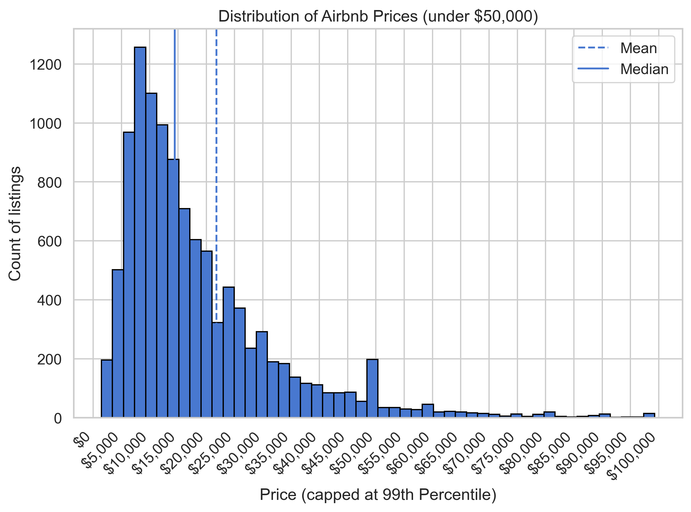
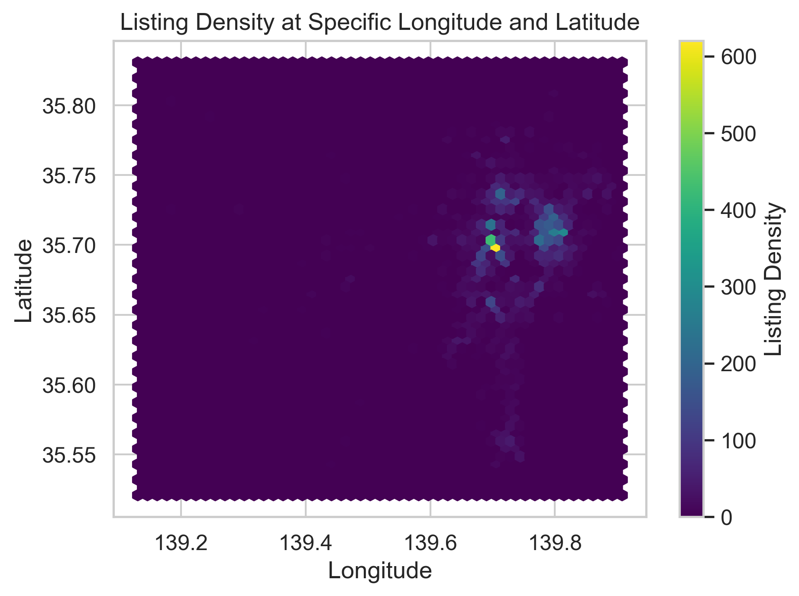
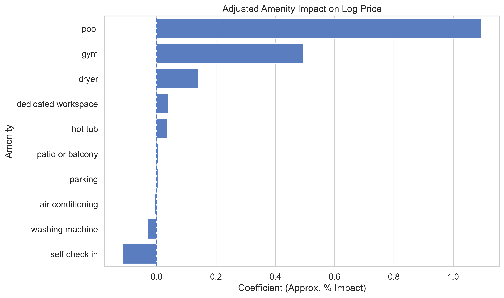
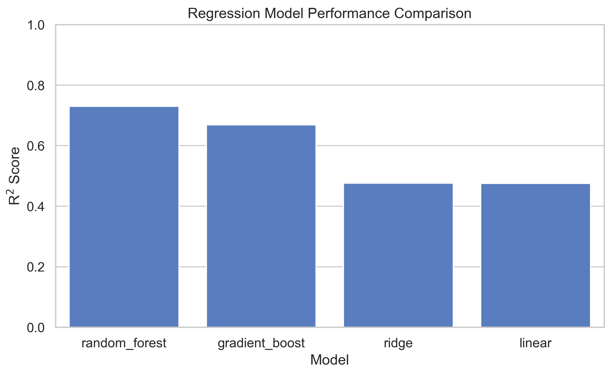
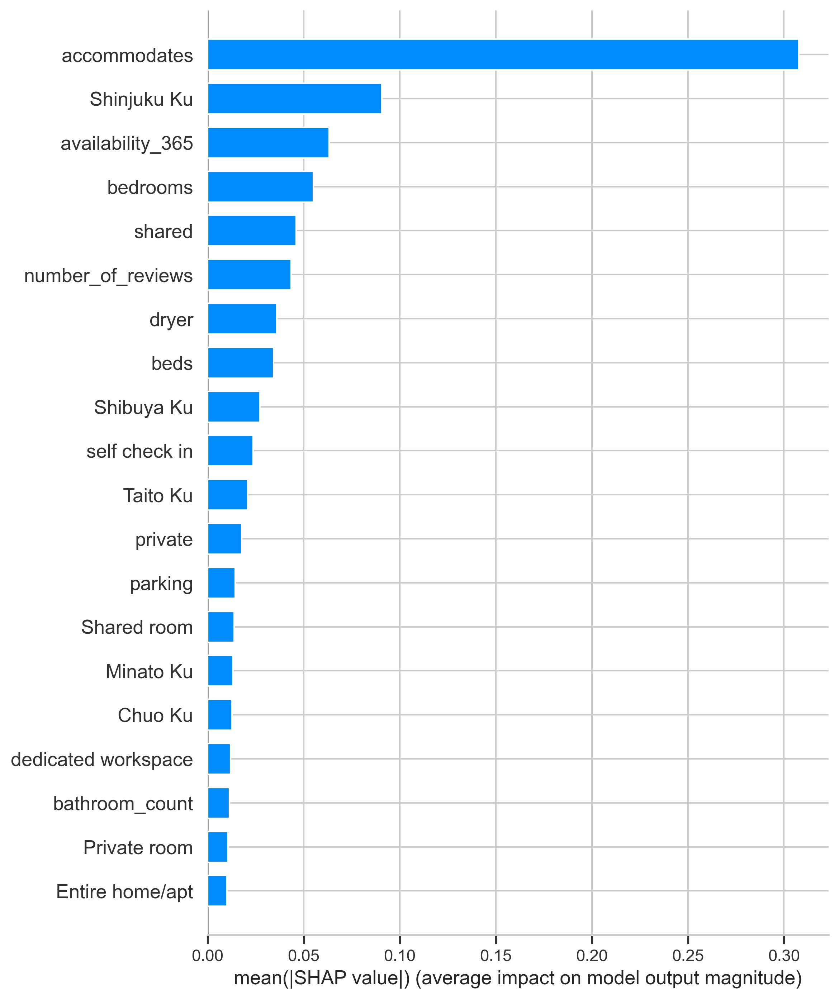
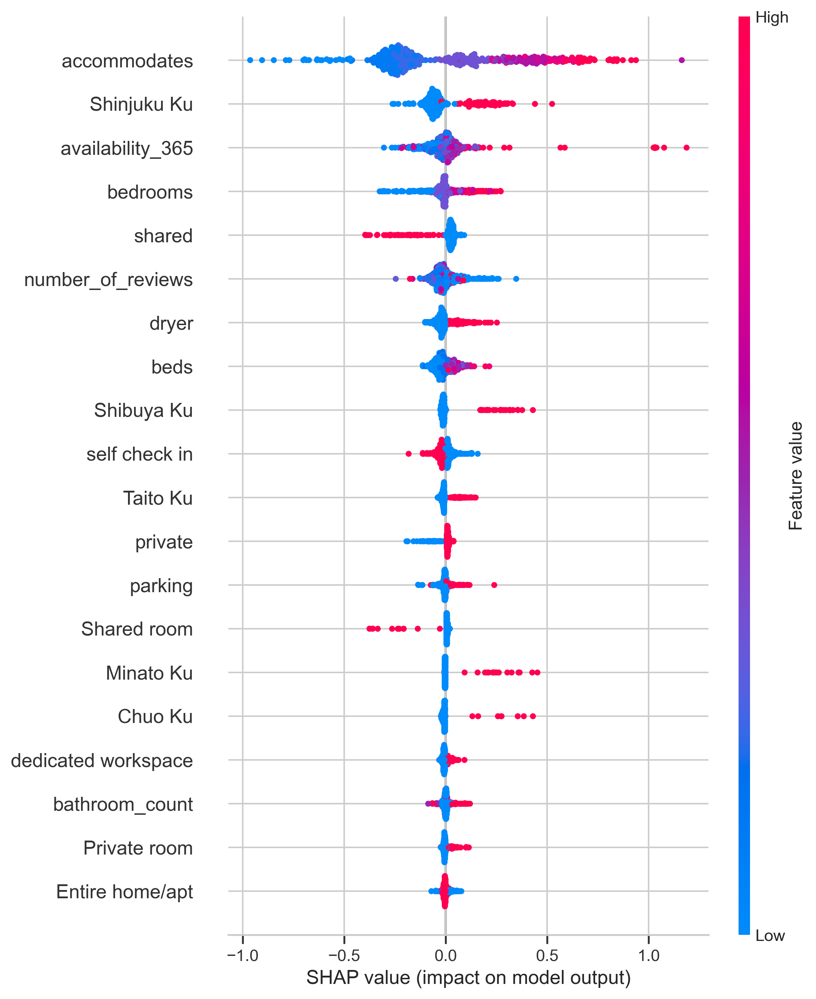

# Tokyo Airbnb Price Analysis
## Project Overview
Tokyo is one of the world's largest and most competitive Airbnb markets. This project analyzes over 11,000 Airbnb listings to identify the factors that influence listing prices and builds machine learning models capable of predicting prices from listing characteristics.

This project combines 
- Exploratory Data Analysis (EDA)
- Feature Engineering
- Regression Modeling
- Classification Modeling
- Model Explainability using SHAP

### Business Question

**What characteristics drive Airbnb prices in Tokyo and how accurately can listing prices be predicted from property and listing information**

---

## Dataset

Source: [Kaggle Tokyo Airbnb Open Data Dataset](https://www.kaggle.com/datasets/tsarromanov/tokyo-airbnb-open-data)

### Listings Dataset
- 11,177 Airbnb Listings
- 75 features

### Reviews Dataset
- 407,712 reviews
- Review history through June 2023

---
## Project Workflow

- Data Cleaning
- Exploratory Data Analysis
- Amenity Analysis
- Feature Engineering
- Regression Models
- Classification Model
- SHAP Explainability

---

## Key Findings

### 1. Price Distribution is Highly Skewed
Most listings are clustered in the lower and middle price ranges while a small number of luxury listings command extremely high prices.

### 2. Location is a Major Pricing Driver
Listings are heavily concentrated in central Tokyo neighborhoods such as Shinjuku, Shibuya, and Taito.

Neighborhood consistently emerged as one of the strongest predictors of price.

### 3. Amenities Fall Into Three Distinct Categories

Amenity analysis suggested three broad groups:

| Category | Examples | Impact |
|-----------|-----------|-----------|
| Baseline | Air Conditioning, Keypad | Little pricing power |
| Functional | Dryer, Dedicated Workspace | Moderate pricing premium |
| Luxury | Pool, Gym | Largest pricing premium |

---

## Machine Learning Results

### Regression Models

| Model | RMSE | R² |
|---------|---------|---------|
| Random Forest | 0.384 | 0.730 |
| Gradient Boosting | 0.426 | 0.669 |
| Ridge Regression | 0.535 | 0.476 |
| Linear Regression | 0.536 | 0.475 |

### Best Regression Model

**Random Forest**

- RMSE: 0.384
- R²: 0.730

The Random Forest captured nonlinear relationships between location, capacity, room type, and amenities more effectively than linear models.

---

### Classification Model

Listings were grouped into:

- Low Price
- Mid Price
- High Price

Using K-Nearest Neighbors:

| Metric | Score |
|----------|----------|
| Accuracy | 75.0% |
| F1 Score | 75.0% |

---

## Model Explainability (SHAP)

To understand why the model makes predictions, SHAP values were used.

### Most Important Features

- Accommodates
- Shinjuku Location
- Availability
- Bedrooms
- Bathroom Type
- Number of Reviews
- Dryer
- Beds

### SHAP Beeswarm Plot

The beeswarm plot shows both feature importance and whether a feature increases or decreases predicted price.

Key observations:

- Larger listings consistently increase predicted price.
- Listings located in Shinjuku tend to increase predicted price.
- Certain amenities contribute positively but are less influential than property size and location.

---

## Technologies Used

### Data Analysis
- Python
- Pandas
- NumPy

### Visualization
- Matplotlib
- Seaborn

### Machine Learning
- Scikit-Learn
- Random Forest
- HistGradientBoosting
- KNN Classification

### Explainability
- SHAP

---

